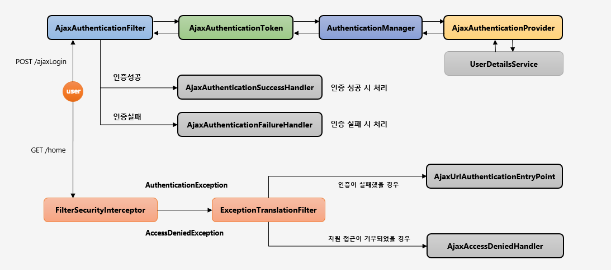
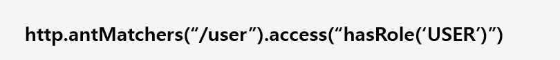
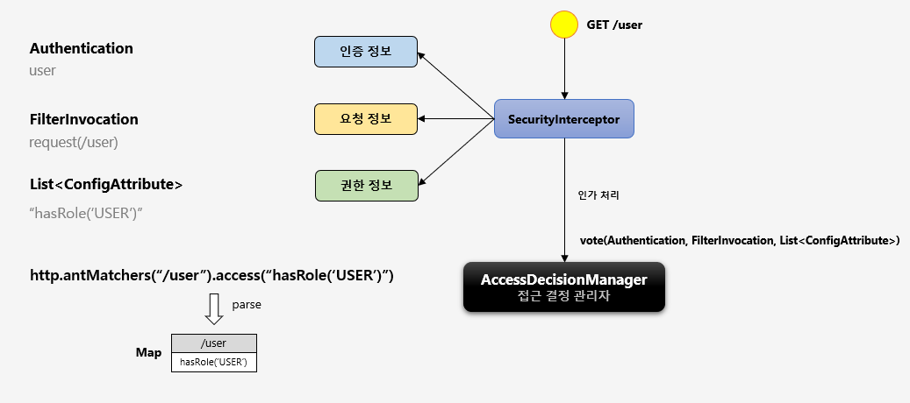

# 실습 

## 권한 설정
1. `inMemoryAuthentication` 권한을 줄 때는 `ADMIN`이라고 할지라도 권한을 전부 명시해줘야만 사용할 수 있다.
```java
@Configuration
@EnableWebSecurity
public class SecurityConfig extends WebSecurityConfigurerAdapter {

	@Override
	protected void configure(AuthenticationManagerBuilder auth) throws Exception {

		String password = passwordEncoder().encode("1111");
		auth.inMemoryAuthentication()
			.withUser("user")
			.password(password)
			.roles("USER")
			.and()
			.withUser("manager")
			.password(password)
			.roles("MANAGER")
			.and()
			.withUser("admin")
			.password(password)
			.roles("ADMIN");
	}
}
```


## WebIgnore 설정 
1. webSecurity에 설정시 `FitlerIntercepter`에서 확인하지 않게 된다.
```java
@Configuration
@EnableWebSecurity
public class SecurityConfig extends WebSecurityConfigurerAdapter {
	@Override
	public void configure(WebSecurity web) throws Exception {
		web.ignoring()
			.requestMatchers(PathRequest.toStaticResources().atCommonLocations());
	}
}
```

## PasswordEncoder 
1. 비밀번호를 안전하게 암호화여 제공 
2. SpringSecurity 5.0 이전에는 기본 PasswordEncoder가 평문을 지원하는 NoOpPasswordEncoder(현재는 삭제)

### 생성 
+ passwordEncoder passwordEncoder = PasswordEncoderFactories.createDelegationPasswordEncoder();
+ 여러개의 PasswordEncoder를 유형을 선언한뒤 상황에 맞게 선택해서 사용할 수 있또록 지원하는 Encoder 이다.

### 암호화 포맷 :{id}encodedPassword
기본 포맷 {bcrypt}
알고리즘 종류 : bcrypt,noop,sh256

```java
public final class PasswordEncoderFactories {
	public static PasswordEncoder createDelegatingPasswordEncoder() {
		String encodingId = "bcrypt";
		Map<String, PasswordEncoder> encoders = new HashMap<>();
		encoders.put(encodingId, new BCryptPasswordEncoder());
		encoders.put("ldap", new org.springframework.security.crypto.password.LdapShaPasswordEncoder());
		encoders.put("MD4", new org.springframework.security.crypto.password.Md4PasswordEncoder());
		encoders.put("MD5", new org.springframework.security.crypto.password.MessageDigestPasswordEncoder("MD5"));
		encoders.put("noop", org.springframework.security.crypto.password.NoOpPasswordEncoder.getInstance());
		encoders.put("pbkdf2", new Pbkdf2PasswordEncoder());
		encoders.put("scrypt", new SCryptPasswordEncoder());
		encoders.put("SHA-1", new org.springframework.security.crypto.password.MessageDigestPasswordEncoder("SHA-1"));
		encoders.put("SHA-256",
			new org.springframework.security.crypto.password.MessageDigestPasswordEncoder("SHA-256"));
		encoders.put("sha256", new org.springframework.security.crypto.password.StandardPasswordEncoder());
		encoders.put("argon2", new Argon2PasswordEncoder());
		return new DelegatingPasswordEncoder(encodingId, encoders);
	}
}
```

### 질문
1. ValueObject 와 entity에서의 객체지향 설계뿐만아니라 dto도 그런식으로 설계가 가능하지 않을까?
2. 변경되지 않는 메소드가 있는경우 

## AuthenticationProvider 만들기

1. 프로세스 
   

2. ProviderManager에서 생성 객체를사용하는 확인해보자
### 설정 
```java
	@Override
	protected void configure(AuthenticationManagerBuilder auth) throws Exception {
    	/*auth.userDetailsService()*/
		auth.authenticationProvider(authenticationProvider());
	}

	@Bean
	public AuthenticationProvider authenticationProvider() {
		return new CustomAuthenticationProvider();
	}
```

### UsernamePasswordAuthenticationToken
1. 사용자가 인증을 처음 시도할 때 `인증필터`가 사용자의 아이디와 패스워드를 만드는 객체
```java
public UsernamePasswordAuthenticationToken(Object principal, Object credentials) {
	super(null);
	this.principal = principal;
	this.credentials = credentials;
	setAuthenticated(false);
}
```

1. 최종적으로 인증이 성공한 이유의 권한정보까지 포함하여 리턴한다.
```java
public UsernamePasswordAuthenticationToken(Object principal, Object credentials,
    Collection<? extends GrantedAuthority> authorities) {
    super(authorities);
    this.principal = principal;
    this.credentials = credentials;
    super.setAuthenticated(true); // must use super, as we override
}
```

## 커스텀 로그인 페이지 만들기 


1. CSRF를 disabled 하지 않으면 해당 페이지로 요청이 들어갈 수 없게된다. 
```html
 <input type="hidden" name="${_csrf.parameterName}" value="${_csrf.token}"/>
````

```html
 <input type="hidden" name="${_csrf.parameterName}" value="${_csrf.token}"/>
````

```java
<%@ taglib prefix="sec" uri="http://www.springframework.org/security/tags"%>

<form id="loginForm" name="loginForm">
    <sec:csrfInput />
</form>
```

## 로그아웃 

1. 로그아웃 기능 추가 

```java
    @GetMapping("/logout")
    public String logout(HttpServletRequest request, HttpServletResponse response) {
        Authentication authentication = SecurityContextHolder.getContext().getAuthentication();

        if (authentication != null) {
            new SecurityContextLogoutHandler().logout(request, response, authentication);
        }
        return "redirect:/";
    }
```

## WebAuthenticationDetails, AuthenticationDetailsSource
Authentication 객체는 `details`를 가지고 있다.
details는 `WebAuthenticationDetails` 인데 `WebAuthenticationDetails` 생성을 `AuthenticationDetailsSource`가 생성한다.


1. AuthenticationDetailsSource
   - WebAuthenticationDetails 객체를 생성
2. WebAuthenticationDetails
   - 인증 과정 중 전달된 데이터를 저장 
   - `Authentication` details 속성에 저장
```java
     request.getParamter("id");
     request.getParamter("password")
```

## 로그인 성공 

```java
public class CustomAuthSuccessHandler implements AuthenticationSuccessHandler {
	private RequestCache requestCache = new HttpSessionRequestCache();
	private RedirectStrategy redirectStratgy = new DefaultRedirectStrategy();
	private final String DEFAULT_LOGIN_SUCCESS_URL = "/home";
	
	////////////////////////////////////////////////////////////////////////////////
	//< public functions (override)

	@Override
	public void onAuthenticationSuccess(HttpServletRequest request, HttpServletResponse response, Authentication authentication) throws IOException, ServletException {
		//< clear authentication error
		clearAuthenticationAttributes(request);
		//< redirect page
		redirectStrategy(request, response, authentication);
	}
	
	////////////////////////////////////////////////////////////////////////////////
	//< private functions
	
	private void clearAuthenticationAttributes(HttpServletRequest request) {
		HttpSession session = request.getSession(false);
		if(session != null) {
			session.removeAttribute(WebAttributes.AUTHENTICATION_EXCEPTION);
		}
	}
	
	private void redirectStrategy(HttpServletRequest request, HttpServletResponse response, Authentication authentication) throws IOException, ServletException {
		//< get the saved request
		SavedRequest savedRequest = requestCache.getRequest(request, response);
		if(savedRequest == null) {
			redirectStratgy.sendRedirect(request, response, DEFAULT_LOGIN_SUCCESS_URL);
		}
		else {
			//< get the authorities
			Set<String> roles = AuthorityUtils.authorityListToSet(authentication.getAuthorities());
			if(roles.contains(ERole.ADMIN.getValue())) {
				redirectStratgy.sendRedirect(request, response, "/home/admin");
			}
			else if(roles.contains(ERole.MANAGER.getValue())) {
				redirectStratgy.sendRedirect(request, response, "/home/user");
			}
			else {
				redirectStratgy.sendRedirect(request, response, "/home/guest");
			}
		}
	}
}

```

## 로그인 실패  

1. UsernameNotFoundException : 계정 없음
2. BadCredentialsException : 비밀번호 불일치
3. AccountExpiredException : 계정만료
4. CredentialExpiredException : 비밀번호 만료
5. DisabledException : 계정 비활성화
6. LockedException : 계정잠김


## 사용자 인증을 했지만 , 자원에 접근하는 경우 

1. 인가 예외는 `ExceptionTranslateFilter`가 처리합니다.
2. `FilterSecurityInterceptor`가 권한 예외를 발생 시켜서 다시 `ExceptionTranslateFilter`에게 위임


## AJAX 인증 



1. AjaxAuthenticationFilter
   - AbstractAuthenticationProcessingFilter 상속 
     - form 인증처리도 이 클래스를 상속해서 구현하고 있다.
   - 필터 작동 조건 
      - AntPathRequestMatcher('/api/login') 로 요청정보와 매칭하고 요청 방식이 Ajax 이면 필터 작동 
   - AjaxAuthenticationToken 생성하여 AuthenticationManager 에게 전달하여 인증처리 
   - Filter 추가 
     - http.addFilterBefore(AjaxAuthenticationFilter(), UsernamePasswordAuthenticationFilter.class)


2. AjaxLoginUrlAuthenticationEntryPoint
- 인가 예외를 발생을 ExceptionTranslateFilter 처리 
  - AuthenticationEntryPoint
    - 인증을 받을 수 있도록 요청을처리 

- 인증은 했지만 권한이 없는 경우 
- accessDeniedHandler.handle로 처리합니다.
  

## AJAX Custom DSLs 구현하기 

# AbstractHttpConfigurer
    - 스프링 시큐리티 초기화 설정 클래스
    - 필터 핸들러 메소드 속성 등을 한 곳에 정의 하여 처리할 수 잇는 편리함 제공 
1. 초기화
public void init (H http);
2. 설정
public void configure(H http);
3. 사용 
HttpSecurity의 appli (configure) 사용


## AJAx 로그인 구현 & csrf 설정 
```html
<meta id ="_csrf" name="_csrf" th:content="${_csrf.token}" />
<meta id ="_csrf_header" name="_csrf_header" th:content="${_csrf_headerName}" />
```
```javascript
$("meta[name="_csrf_header"]").attr('content');
$("meta[name="_csrf"]").attr('content');

$.ajax({
  type: "post",
  url: "/api/login",
  data: JSON.stringify(data),
  dataType : "json",
  beforeSend : function (xhr) {
    xhr.setRequestHeader(csrfHeader,csrfToken);
    xhr.setRequestHeader("X-Requested","XMLHttpRequest");
    xhr.setRequestHeader("Content-type","application/json");
  },
  success : function (data) {
    location.href="/"
  },
  error : function(xhr, status, error) {
    location.href = "/login?error=true&exception=" + xhr.responseText;
  }
  
})


```


# 주요 인가 프로세스 인처리 

1. 스프링 시큐리티의 인가처리 방법은 어떻게 동작할까?
  - 사용자(인증정보)가 `/user`(요청정보)에 접근하기 위해서는 ROLE_User(권한정보) 권한이 필요하다




2. 우리가 요청을 보게될 때 스프링 시큐리티는 `AccessDecisionManager`를 통해 인가처리를 하게됩니다.


- Authentication `인증정보`는 SecurityContextHolder 안에 SecurityContext 로부터
- FilterInvocation 로부터 `요청정보`
- 권한정보는 `@SecurityConfig` 에서 설정한 권한정보를 각각 키(URL) value 권한정보 (hasRole("USER"))

## ExpressionBasedFilterInvocationSecurityMetadataSource
- 내부적으로 `Map`을 가지고 있다. 
  - requestToExpressionAttributesMap 에 각각의 자원정보와 권한정보를 가지고 있다.
- 실제 `@SecurityConfig` 에서 설정한 권한정보를 각각 키(URL) value 권한정보 (hasRole("USER"))

## DefaultFilterInvocationSecurityMetadataSource
- 실제 `저장된 정보를 추출`하여서 매칭되는 URL 정보를 탐색

## 인가 FLOW
----
1. 로그인 요청 
2. `FilterSecurityInvocation` 에서 `FilterInvocation` 을 통해 `요청정보`를 가져옵니다.
3. 요청정보를 `AbstractSecurityInterceptor` 에서 권한정보를 `DefaultFilterInvocationSecurityMetaDataSource` 에서 정보를 요청합니다. 
   - 이 때 해당 요청한 정보에 대한 정보와 매칭되는정보가 있는지 확인합니다.
4. `AbstractSecurityInterceptor` 에서 `SecurityContext` 정보도 가지고옵니다. 
5. 3개의 정보를 `accessDesisionManager`에게 위임하여 해당 정보에 대한 권한이 있는지 확입합니다.


1. `FilterInvocationSecurityMetadataSource`
   - URL 권한정보 추출 
2. `MethodSecurityMetadataSource`
   - Method 권한정보 추출 

 