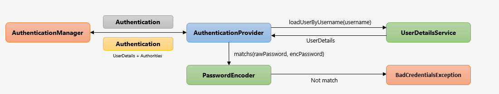
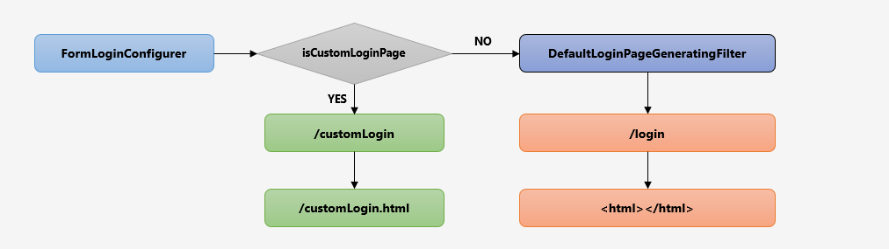

# 실습 

## 권한 설정
1. `inMemoryAuthentication` 권한을 줄 때는 `ADMIN`이라고 할지라도 권한을 전부 명시해줘야만 사용할 수 있다.
```java
@Configuration
@EnableWebSecurity
public class SecurityConfig extends WebSecurityConfigurerAdapter {

	@Override
	protected void configure(AuthenticationManagerBuilder auth) throws Exception {

		String password = passwordEncoder().encode("1111");
		auth.inMemoryAuthentication()
			.withUser("user")
			.password(password)
			.roles("USER")
			.and()
			.withUser("manager")
			.password(password)
			.roles("MANAGER")
			.and()
			.withUser("admin")
			.password(password)
			.roles("ADMIN");
	}
}
```


## WebIgnore 설정 
1. webSecurity에 설정시 `FitlerIntercepter`에서 확인하지 않게 된다.
```java
@Configuration
@EnableWebSecurity
public class SecurityConfig extends WebSecurityConfigurerAdapter {
	@Override
	public void configure(WebSecurity web) throws Exception {
		web.ignoring()
			.requestMatchers(PathRequest.toStaticResources().atCommonLocations());
	}
}
```

## PasswordEncoder 
1. 비밀번호를 안전하게 암호화여 제공 
2. SpringSecurity 5.0 이전에는 기본 PasswordEncoder가 평문을 지원하는 NoOpPasswordEncoder(현재는 삭제)

### 생성 
+ passwordEncoder passwordEncoder = PasswordEncoderFactories.createDelegationPasswordEncoder();
+ 여러개의 PasswordEncoder를 유형을 선언한뒤 상황에 맞게 선택해서 사용할 수 있또록 지원하는 Encoder 이다.

### 암호화 포맷 :{id}encodedPassword
기본 포맷 {bcrypt}
알고리즘 종류 : bcrypt,noop,sh256

```java
public final class PasswordEncoderFactories {
	public static PasswordEncoder createDelegatingPasswordEncoder() {
		String encodingId = "bcrypt";
		Map<String, PasswordEncoder> encoders = new HashMap<>();
		encoders.put(encodingId, new BCryptPasswordEncoder());
		encoders.put("ldap", new org.springframework.security.crypto.password.LdapShaPasswordEncoder());
		encoders.put("MD4", new org.springframework.security.crypto.password.Md4PasswordEncoder());
		encoders.put("MD5", new org.springframework.security.crypto.password.MessageDigestPasswordEncoder("MD5"));
		encoders.put("noop", org.springframework.security.crypto.password.NoOpPasswordEncoder.getInstance());
		encoders.put("pbkdf2", new Pbkdf2PasswordEncoder());
		encoders.put("scrypt", new SCryptPasswordEncoder());
		encoders.put("SHA-1", new org.springframework.security.crypto.password.MessageDigestPasswordEncoder("SHA-1"));
		encoders.put("SHA-256",
			new org.springframework.security.crypto.password.MessageDigestPasswordEncoder("SHA-256"));
		encoders.put("sha256", new org.springframework.security.crypto.password.StandardPasswordEncoder());
		encoders.put("argon2", new Argon2PasswordEncoder());
		return new DelegatingPasswordEncoder(encodingId, encoders);
	}
}
```

### 질문
1. ValueObject 와 entity에서의 객체지향 설계뿐만아니라 dto도 그런식으로 설계가 가능하지 않을까?
2. 변경되지 않는 메소드가 있는경우 

## AuthenticationProvider 만들기

1. 프로세스 
   

2. ProviderManager에서 생성 객체를사용하는 확인해보자
### 설정 
```java
	@Override
	protected void configure(AuthenticationManagerBuilder auth) throws Exception {
    	/*auth.userDetailsService()*/
		auth.authenticationProvider(authenticationProvider());
	}

	@Bean
	public AuthenticationProvider authenticationProvider() {
		return new CustomAuthenticationProvider();
	}
```

### UsernamePasswordAuthenticationToken
1. 사용자가 인증을 처음 시도할 때 `인증필터`가 사용자의 아이디와 패스워드를 만드는 객체
```java
public UsernamePasswordAuthenticationToken(Object principal, Object credentials) {
	super(null);
	this.principal = principal;
	this.credentials = credentials;
	setAuthenticated(false);
}
```

1. 최종적으로 인증이 성공한 이유의 권한정보까지 포함하여 리턴한다.
```java
public UsernamePasswordAuthenticationToken(Object principal, Object credentials,
    Collection<? extends GrantedAuthority> authorities) {
    super(authorities);
    this.principal = principal;
    this.credentials = credentials;
    super.setAuthenticated(true); // must use super, as we override
}
```

## 커스텀 로그인 페이지 만들기 


1. CSRF를 disabled 하지 않으면 해당 페이지로 요청이 들어갈 수 없게된다. 
```html
 <input type="hidden" name="${_csrf.parameterName}" value="${_csrf.token}"/>
````

```html
 <input type="hidden" name="${_csrf.parameterName}" value="${_csrf.token}"/>
````

```java
<%@ taglib prefix="sec" uri="http://www.springframework.org/security/tags"%>

<form id="loginForm" name="loginForm">
    <sec:csrfInput />
</form>
```

## 로그아웃 

1. 로그아웃 기능 추가 

```java
    @GetMapping("/logout")
    public String logout(HttpServletRequest request, HttpServletResponse response) {
        Authentication authentication = SecurityContextHolder.getContext().getAuthentication();

        if (authentication != null) {
            new SecurityContextLogoutHandler().logout(request, response, authentication);
        }
        return "redirect:/";
    }
```

## WebAuthenticationDetails, AuthenticationDetailsSource
Authentication 객체는 `details`를 가지고 있다.
details는 `WebAuthenticationDetails` 인데 `WebAuthenticationDetails` 생성을 `AuthenticationDetailsSource`가 생성한다.


1. AuthenticationDetailsSource
   - WebAuthenticationDetails 객체를 생성
2. WebAuthenticationDetails
   - 인증 과정 중 전달된 데이터를 저장 
   - `Authentication` details 속성에 저장
```java
     request.getParamter("id");
     request.getParamter("password")
```
   

